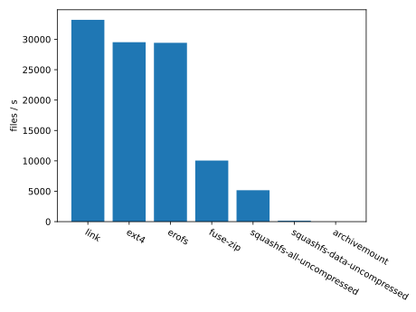

# 适合保存大量小文件数据集的文件系统性能测试

## 背景

在机器学习中，很多数据集都是由大量的小文件构成的。而直接使用普通的文件系统来保存这些文件会带来一些困扰：

* 迁移速度慢：一个数据集一般都是一个整体，而若作为大量小文件储存时，若要进行复制，删除等操作，则需以单个文件为单位进行。在机械硬盘上，这会破坏读取的连续性。通常，在机械硬盘上，大量小文件的复制会比大文件的复制慢1-2个数量级。
* 浪费存储空间：内部或外部碎片会导致磁盘存储空间无法被充分利用。
* 无法实现连续读取：应用程序无法获知文件在磁盘上的物理位置，因此，无法优化应用程序，通过使访问更加连续来提高性能。

因此，此前很多人在实验中使用了一些方案来将数据集保存在单个文件中（lmdb等），并自行实现逻辑来从中提取需要的内容。但这也有些不足：

* 开发成本高：从单个文件中提取部分内容较直接读取整个文件困难很多，特别是，文件系统的路径可以直接在各个组件中传递，而无需传递实际的数据。这在调用第三方库时区别尤其大。
* 调试困难：若要手工检查内容，则必须使用专门的工具。

数据集一般具有以下特点：虽然由大量文件构成，但在进行迁移操作时，一般都是作为一个整体进行的；数据集一旦确定，其中的内容极少会被修改。因此，我认为使用如下方案是较好的选择：

* 在迁移时，可将整个数据集作为一个整体。可实现为：块设备、文件系统镜像、归档、压缩包等形式。
* 在使用时，将数据集挂载为只读文件系统，数据集中的每个文件依然拥有自己的文件路径。

## 测试方法

* 挂载一个tmpfs文件系统，在其中创建大量小文件。
* 在tmpfs中创建不同文件系统的镜像（压缩包），将小文件复制入镜像中。
* 将镜像挂载
* 测试随机读取镜像中的小文件的吞吐量

## 测试环境

个人PC

* CPU： Intel i7-6700HQ
* RAM： 16G

## 测试对象

* 符号链接至tmpfs
* ext4
* squashfs (禁用所有压缩)
* squashfs (禁用数据压缩)
* erofs
* fuse-zip (zip仅存储)
* archivemount (zip仅存储)

## 环境准备

* Ubuntu 20.04 或更高
* 默认配置下，至少8G内存
* sudo权限

```bash
sudo apt install python3 python3-pip squashfs-tools erofs-utils zip fuse-zip archivemount
pip install -r requirments.txt
```

## 测试结果



上图为队列深度64时各方案吞吐量对比。

直接使用tmpfs是最快的方案。

老牌的文件系统ext4速度非常理想，但ext4不是为只读目的设计的，在使用时要预先决定分配空间大小，若太大则浪费空间，太小则可能存不下，或在拷入数据时带来潜在的高度碎片化的问题。另外，`mkfs.ext4`程序的`-p`选选项可以直接在构建镜像时包含一些文件，但如果使用这个选项，不但构建镜像的速度非常慢，而且本测试中的文件读取吞吐量也会下降数倍。

EROFS是华为最近贡献给Linux内核的。它的性能非常高，和ext4不分上下。但它的问题就是太新了，部署较为困难。2019年8月它的内核驱动才[正式进入主线内核][1]。目前Ubuntu 18.04升级到最新的HWE内核可以挂载EROFS，而Ubuntu 20.04才提供了预编译的`mkfs.erofs`二进制文件。

`fuse-zip`虽然比前两者要慢一倍以上，但这个成绩也相当出彩了，毕竟在这个测试中完全是CPU瓶颈的，作为使用fuse的文件系统，它势必要花费大量CPU时间在内核和用户空间之间拷贝数据。这样的吞吐量水平已经大大超越了1Gbps网络传输的速度，想必在实际应用中应该不会成为性能瓶颈。而它使用的zip格式，在格式的通用性上比其他方案更胜一筹。

squashfs真是个让人又爱又恨的项目。它在内核中已经有10余年的历史了，且已经在很多领域得到了应用，构建squashfs的`mksquashfs`程序看上去也十分成熟，性能很高。但是squashfs的内核代码实现是比较老旧的，多年来很少维护，缺乏优化。其性能相比其他方案来看，是很低的。作为跑在内核空间的程序，它甚至在所有测试中都低于基于fuse的`fuse-zip`。经过profile后，发现在高并发的情况下，spin-lock占用了绝大多数的CPU时间。而它引以为傲的压缩功能，更是把它的并发读取性能拖慢到了完全没法看的地步，连机械硬盘的随机读取都无法跑满。

`archivemount`就不做什么评价了，每秒只能读取几个文件，在我们的场景中根本没有用。

## 未来工作

本测试完全在内存中进行，测试的是各个文件系统的性能上限。而它们在处理IO的延迟时表现如何还有待进一步扩展。

由于环境要求太新，部分方案尚未能在服务器上测试，所有测试均来自我的个人PC，其性能与服务器会有一定差距。特别是，在高并发时，服务器由于有更多的CPU核心，其速度应该更快。

## 总结

`fuse-zip`看上去是个可靠的，可以立刻方便部署的解决方案。长期来看，使用ceph的块设备rbd，上面写入EROFS的镜像是目前可以预见的最佳的方案。


[1]: https://github.com/torvalds/linux/commit/47e4937a4a7ca4184fd282791dfee76c6799966a
